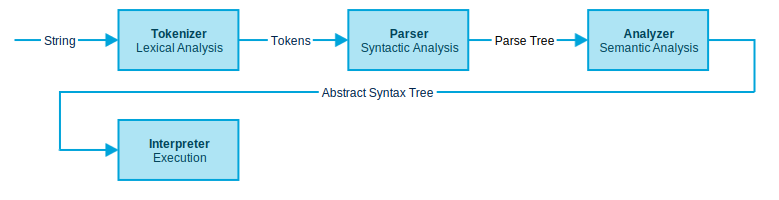

.. PyCep documentation master file, created by
   sphinx-quickstart on Sun Nov 15 22:54:12 2015.
   You can adapt this file completely to your liking, but it should at least
   contain the root `toctree` directive.

Welcome to PyCep's documentation!
=================================

PyCep (Python Inception) is a Python 2.7 interpreter written in Python 2.7.

PyCep was created as study project to teach `myself <https://github.com/dlorch>`_
about writing interpreters. PyCep's externally exported methods are modelled
after the Python standard library, thus have identical method signatures and
return the same data structures as those offered by Python itself, while being
entirely written in Python.

Try it out!
-----------

.. raw:: html

   
   
   <select id="snippets"></select>
   <input type="submit" id="run" value="Run" />
   
def fib(n):
       a, b = 0, 1
       while a < n:
           print a
           a, b = b, a+b

   fib(1000)

   <pre id="result"></pre>
   
   
   
   

Implementation Status
---------------------

+-------------+---------+-----------------------------------------------------+ 
| Module      | Status  | Comments                                            | 
+=============+=========+=====================================================+ 
| Tokenizer   | 0%      | Forwarding calls to ``tokenize.generate_tokens()``. |
+-------------+---------+-----------------------------------------------------+ 
| Parser      | 5%      | Parsing a handful of example programs.              |
+-------------+---------+-----------------------------------------------------+ 
| Analyzer    | 2%      | Analyzing very few example programs.                | 
+-------------+---------+-----------------------------------------------------+ 
| Interpreter | 0%      | Forwarding calls to ``exec``                        | 
+-------------+---------+-----------------------------------------------------+

Design Goals
------------

* External methods have the `same signatures and produce the same results <https://github.com/dlorch/pycep/tree/master/pycep/tests>`_
  as those provided by the standard Python library
* Each of the interpreter's phases is built upon the previous phase, can be
  intercepted and studied independently of the other parts of the system

Sources
-------

Get the sources from https://github.com/dlorch/pycep/

Contents
--------

.. toctree::
   :maxdepth: 2

   pycep.rst
   references.rst
   tools.rst

Indices and tables
==================

* :ref:`genindex`
* :ref:`modindex`
* :ref:`search`

